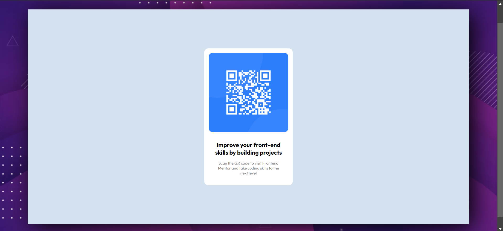

# Frontend Mentor - QR code component solution

This is a solution to the [QR code component challenge on Frontend Mentor](https://www.frontendmentor.io/challenges/qr-code-component-iux_sIO_H). Frontend Mentor challenges help you improve your coding skills by building realistic projects. 

## Table of contents

- [Frontend Mentor - QR code component solution](#frontend-mentor---qr-code-component-solution)
  - [Table of contents](#table-of-contents)
  - [Overview](#overview)
    - [Screenshot](#screenshot)
  - [My process](#my-process)
    - [Built with](#built-with)
    - [What I learned](#what-i-learned)
    - [Continued development](#continued-development)
  - [Author](#author)

## Overview

QR component is a simple component web responsive that simulates a QR code. It was built using HTML and CSS. 

### Screenshot

Mobile design:

Computer design:

## My process

### Built with

- Semantic HTML5 markup
- CSS custom properties
- Flexbox
- Mobile-first workflow
- 
### What I learned

I learned about how padding and margin work in CSS. I also learned about how to use flexbox to align elements in the center of the page, the @media rule to make the page responsive.

### Continued development

I want to continue learning about CSS and HTML to improve my skills. Also, I want to make a QR-code generator in the future, for my future projects.

## Author
- Frontend Mentor - [@Luxfer02](https://www.frontendmentor.io/profile/Luxfer02)
- Github - [@Luxfer02](https://github.com/Luxfer02/luxfer02.github.io)
